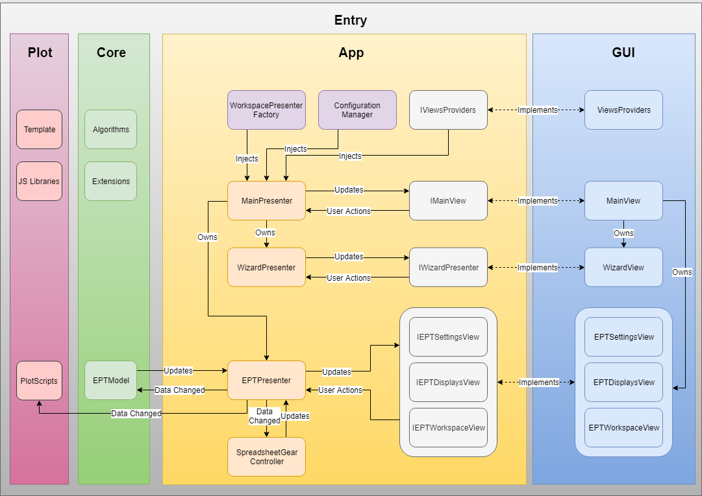
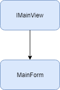
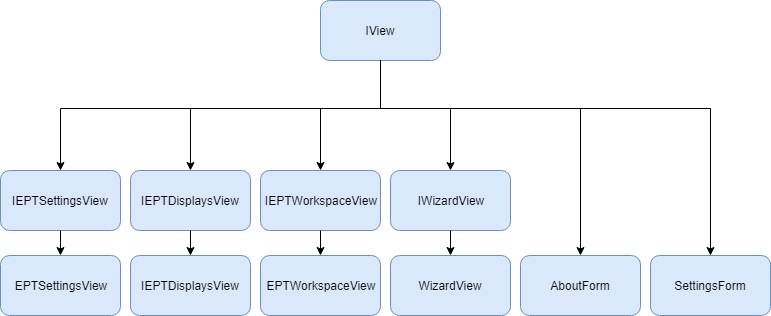
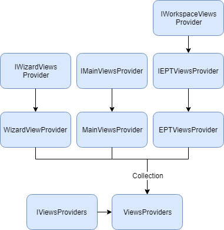
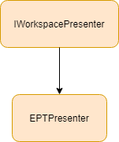

# D&V ReportAnalytics

- Read and process xls/xlsx files
- Data interpolation
- 3D surface graph plotting
- Configuration import / export


  
[][dotnet]
[][spreadsheetgear]
[][cefsharp]
[][xplot]
[][plotlyjs]

## Contents
- [Built With](#Built-With)
- [Get Started](#Get-Started)
- [Architecture](#Architecture)
- [Inheritance](#Inheritance)
  - [Main View](#Main-View)
  - [Views](#Views)
  - [View Providers](#View-Providers)
  - [Presenter](#Presenter)
- [APIs](#APIs)
  - [DV_ReportAnalytics.App](#DV_ReportAnalyticsApp)
    - [Interfaces](#interfaces)
      - [IViews](#IViews)
      - [IMainView](#IMainView)
      - [IWizardView](#IWizardView)
      - [IWorkspaceViewsProvider](#IWorkspaceViewsProvider)
      - [IViewsProviders](#IViewsProviders)
      - [IWorkspacePresenter](#IWorkspacePresenter)
    - [SpreadsheetGear Wrapper](#SpreadsheetGear-Wrapper)
    - [Table Data Struct](#Table-Data-Struct)
    - [Range Extensions](#Range-Extensions)
    - [Table Extensions](#Table-Extensions)
    - [WorkbookView Controller](#WorkbookView-Controller)
    - [Report Type Enum](#Report-Type-Enum)
    - [Configuration Manager](#Configuration-Manager)
    - [Workspace Presenter Factory](#Workspace-Presenter-Factory)
  - [DV_ReportAnalytics.Core](#DV_ReportAnalyticsCore)
    - [Data Set Wrapper](#Data-Set-Wrapper)
    - [Table Info](#Table-Info)
    - [Data Set Extensions](#Data-Set-Extensions)
    - [Algorithms](#Algorithms)
      - [Interpolation](#Interpolation)
    - [Models](#Models)
      - [EPT Model](#EPT-Model)
- [Team](#Team)
- [Progression](#Progression)
- [Copyright](#Copyright)

## Built With
This project is based on .Net Framework 4.7.1.  
Open source library XPlot and Plotly.js are used for 3D surface plotting. The proprietary library SpreadsheetGear is also used for Excel sheet displaying and manipulation.
- [.Net Framework][dotnet]
- [SpreadSheetGear][spreadsheetgear]
- [CefSharp][cefsharp]
- [XPlot.Plotly][xplot]
- [Plotly.js][plotlyjs]

## Get Started
This project is developed with Visual Studio 2019 Community version and compatible with older versions. Once the project is opened, the NuGet Package Manager should automatically resolve dependent packages.

## Architecture
The application uses MVP (Model View Presenter) architecture which decouples visual presentation from actual logics.



There are four layers exist in this project: GUI, App, Plot, Core.
- GUI: This layer implements view interfaces specified in App layer. Generally the GUI layer **does not contain any logics** other than necessary code for view interactions. All user actions will be sent to App layer through events. It is suggested that all views should implement *interfaces* defined in App layer. If a view interface is not designed specifically for a view, that view should implement general `IView` interface. Otherwise App layer will possiblly not work functionally. Data binding mechanism could be used for simplify data flow.
- APP: This layer acts as a headquarter of this project. All logics, user actions, view update etc. should be implemented here. App layer **does not interact with GUI directly**. Instead, it interacts with view interfaces. Thus, It is suggested that designing a view interface before designing an actually view. In order to create views without knowing implementation details, *provider service injection* method is used for this purpose.
- Plot: This layer is developed with F# scripts. It handles all plot requests and outputs them into HTML files. Then the GUI layer is able to load those 3D graphs.
- Core: This layer contains all algorithms, data models, helper functions etc. needed for data processing. It is called by App layer (presenters) directly.


## Inheritance
This section will brifely demonstrate how the inheritance works.

### Main View


Since Main View is unique so it does not have to implement general view interface. MainForm simply implements `IMainView`.

### Views


Views which are managed by Main View (Main Presenter) should implement general view interface `IView`. You can design specific view interfaces for certain tasks. But all of them should inherit from `IView` (common base).

### View Providers


Views which are designed above **should be wrapped** by view provider. This is the part where magic comes from. In general, presenters do not interact with actual views so they also do not know how to create them. But by *injecting* view provider into presenter constructor, the presenter then has the ability to create views by using this view provider (factory).

### Presenter


In general, the Main Presenter and Wizard Presenter are unique so they do not have to implement a generic interface. However, considering there might be not just one type of reports in the future, report presenter should **implement generic workspace presenter** so that Main Presenter can know how to manipulate them.

## APIs
This section will introduce key APIs in this project.

### DV_ReportAnalytics.App

#### Interfaces
`namespace DV_ReportAnalytics.App.Interfaces`  
All interfaces should be implemented by GUI.

##### IViews
```c#
public interface IView
    {
        event EventHandler RequestClosed; // View close event. Used for triggering certain
                                            // actions like data update.
        void Close(); // This function is supposed to trigger RequestClosed event.
        void Show(); // For View displaying.
        void BindData(object source, object arguments); // Data binding from presenter.
    }
```
IView is the base interface for all visual forms and user controls. You **MUST** implement this interface so that presenters can know how to manipulate views.

##### IMainView
```c#
public interface IMainView
    {
        // Button actions
        event EventHandler OpenClicked;
        event EventHandler<EventArgs<string>> ExportClicked;
        event EventHandler HelpClicked;
        event EventHandler SettingsClicked;
        event EventHandler DisplayClicked;

        void UpdateWorkspace(object content); // This function updates main window workspace.
    }
```
Main View **MUST** implement this interface.

##### IWizardView
```c#
public interface IWizardView : IView
    {
        // UI actions
        event EventHandler<EventArgs<ReportTypes>> WizardSelectionChanged;
        event EventHandler<EventArgs<string>> ConfigImportClicked;
        event EventHandler<EventArgs<string>> ConfigExportClicked;
        event EventHandler ConfigResetClicked;
        string Path { get; } // Stirng for report file path.
        IWorkspacePresenter SelectedPresenter { get; } // Currently selected presenter.
    }
```
Wizard View **MUST** implement this interface.

##### IWorkspaceViewsProvider
```c#
public interface IWorkspaceViewsProvider
    {
        IView CreateSettingsView();
        IView CreateDisplaysView();
        IView CreateWorkspaceView();
    }
```
Generally, workspace consist of three views: *workspace view*, *process settings view* and *table display options view*. This provider is used by workspace presenter so you should keep in mind to implement this interface in your GUI implementation.

##### IViewsProviders
```c#
 public interface IViewsProviders
    {
        IWorkspaceViewsProvider this [ReportTypes type] { get; } // Workspace view provider selector
        IWizardViewsProvider WizardViewsProvider { get; }
        IMainViewsProvider MainViewsProvider { get; }
    }
```
This wrapper is used for collecting all providers needed by presenters. You should implement this interface in your GUI implementation.

##### IWorkspacePresenter
```c#
public interface IWorkspacePresenter
    {
        // Views getter
        IView SettingsView { get; }
        IView DisplaysView { get; }
        IView WorkspaceView { get; }
        void Export(string path); // Report export
        void Initialize(string path); // Initilize data model with specified report file.
        void ReloadWorkspace(); // Refresh workspace view.
        void ImportConfig(string path); // config import
        void ExportConfig(string path); // config export
        void ResetConfig(); // config reset
        string FilePath { get; } // currently working report file.
    }
```
This is the general workspace presenter. You should implement this interface for every new type of report presneter.

#### SpreadsheetGear Wrapper
`namespace DV_ReportAnalytics.App.SpreadsheetGear`  
Under this namespace are the SpreadsheetGear wrapper functions. All SpreadsheetGear related operations **should be defined here** so the plugin APIs will not pollute your code.

##### Table Data Struct
```c#
internal struct TableDataRange
{
    public IRange Label { get; set; }
    public IRange RowLabel { get; set; }
    public IRange ColumnLabel { get; set; }
    public IRange RowHeader { get; set; }
    public IRange ColumnHeader { get; set; }
    public IRange DataBody { get; set; }
    public IRange All { get; set; }
}
```
This structure defines a complete table and provides ways to access an individual part of a table.

##### Range Extensions
```c#
internal static partial class SpreadSheetGear_Range
{
    public static IRange FirstCell(this IRange source);
    public static IRange LastCell(this IRange source);
    public static IRange CellBelow(this IRange source);
    public static IRange CellAbove(this IRange source);
    public static IRange CellRight(this IRange source);
    public static IRange CellLeft(this IRange source);
    public static IRange FirstColumn(this IRange source);
    public static IRange FirstRow(this IRange source);
    public static IRange LastColumn(this IRange source);
    public static IRange LastRow(this IRange source);
    public static IRange RowBelow(this IRange source);
    public static IRange RowAbove(this IRange source);
    public static IRange ColumnRight(this IRange source);
    public static IRange ColumnLeft(this IRange source);
}
```
Extensions for range move operations.

##### Table Extensions
```c#
internal static class SpreadSheetGear_Table
{
    public static TableDataRange InsertTable(this IRange source, TableInfo data); // insert table in selected range.
    public static IEnumerable<TableDataRange> InsertTablesInNewSheet(
        this IWorkbook source, 
        string outputSheet, 
        int maxItemsPerRow,
        IEnumerable<TableInfo>tables); // insert multiple table in a new sheet.
    public static void ApplyHeatMap(this TableDataRange source); // Apply heat map for selected table.
}
```
Extensions for table insertion and heat map.

##### WorkbookView Controller
```c#
public class SpreadsheetGearWorkbookViewController
{
    public WorkbookView WorkbookViewModel { get; set; }
    public SpreadsheetGearWorkbookViewController(WorkbookView workbookView);
    public void Open(string path);
    public void Close();
    public void SaveAs(string path);
    public void UpdateSheetWithTables(IEnumerable<TableInfo> tables, string sheetName, int maxItemsPerRow, bool heatMap);
    public object[,] GetSheetUsedRangeValue(string sheetName);
}
```
This wrapper class is used for WorkbookView manipulation. It is **recommended** to use this class to control your WorkbookView.

#### Report Type Enum
`namespace DV_ReportAnalytics.App`
```c#
public enum ReportTypes : int
{
    None = 0,
    EPTReport
}
```
New type of report should be registered here.

#### Configuration Manager
`namespace DV_ReportAnalytics.App`  
```c#
 public class ConfigurationManager
{
    private Dictionary<ReportTypes, ApplicationSettingsBase> _configs; // Configuration registery.
    private static ConfigurationManager defaultInstance; // Singlton instance.
    public static event EventHandler<EventArgs<string>> ExceptionThrown; // Handles exception for GUI presentation.
    public static ConfigurationManager Default;
    private ConfigurationManager(); // New configuration should be registered in constructor.
    public ApplicationSettingsBase this[ReportTypes type] { get; } // Configuration selector.
    // Instance methods for configuration management.
    public void ResetAll();
    public void ReloadAll();
    public void SaveAll();
    public void Reset(ReportTypes type);
    public void Reload(ReportTypes type);
    public void Save(ReportTypes type);
    public void Import(ReportTypes type, string path);
    public void Export(ReportTypes type, string path);
    // Static methods for configuration management.
    public static void Reset(ApplicationSettingsBase config);
    public static void Reload(ApplicationSettingsBase config);
    public static void Save(ApplicationSettingsBase config);
    public static void Import(ApplicationSettingsBase config, string path);
    public static void Export(ApplicationSettingsBase config, string path);
}
```
Configuration manager is used for manage all configurations in this application. It is a singleton so there is only one instance of manager exist in application at a time. It is not possible to create an instance by `new` key word. Instead, you are supposed to access manager instance by static property `Default` of this class.  
Configuration manage provides two ways to store, read and reset configurations. Instance methods can be used for retrive or write configuration in current manager instance. Static methods can be for any `ApplicationSettingsBase` configuration since they use *reflection* to read and write properties.  
**New configuration should be registered in constructor during registry initialization.**  
Configurations should inherit from `ApplicationSettingsBase` class.

#### Workspace Presenter Factory
`namespace DV_ReportAnalytics.App`  
```c#
 public class WorkspacePresenterFactory
{
    private IViewsProviders _providers; // View providers instance.
    private ConfigurationManager _configmgr; // Configuration manager instance.
    private Dictionary<ReportTypes, Func<IWorkspacePresenter>> _registry; // Workspace presenter registry.
    public IWorkspacePresenter this[ReportTypes key] { get; } // Workspace presenter selector.
    // View providers and configuration manager should be injected through constructor.
    // New presenter should be registered in constructor,
    public WorkspacePresenterFactory(IViewsProviders providers, ConfigurationManager configmrg);
}
```
Workspace presenter factory is used in main presenter to generate workspace presneter instances.  
**New presenter should be registered in constructor during registry initialization.**  
View providers and configuration manager should be injected during factory construction.  

### DV_ReportAnalytics.Core

#### Data Set Wrapper
`namespace DV_ReportAnalytics.Core`  
Data set wrapper provides methods to organize and operate data tables.  

##### Table Info
```c#
public struct TableInfo
{
    public object Label { get; set; }
    public object RowLabel { get; set; }
    public object ColumnLabel { get; set; }
    public object[] RowHeader { get; set; }
    public object[] ColumnHeader { get; set; }
    public object[,] DataBody { get; set; }
}
```
This structure is similiar with `TableDataRange` but it provides actual data of a table. *To avoid unnecessary boxing and unboxing*, all data type are defined as object as it is the default value type read from or write to SpreadsheetGear APIs.

##### Data Set Extensions
```c#
 public static class DataSetExtensions
{
    private static DataTable CreateDataTable(string tablename, string[] fields);
    public static void AddTable(this DataSet source, string tablename, string[] fields, object[] values);
    public static TableInfo GetTableInfo(this DataTable source, int rowfield, int colfield, int datafield);
    public static void Interpolate(this ref TableInfo source, int rowInterp, int colInterp)
}
```
This static class provides ways to create, get and interpolate tables.

#### Algorithms
`namespace DV_ReportAnalytics.Core`  
Algorithms for data processing.

##### Interpolation
```c#
 internal static class Interpolation
{
    // Uses binary search to find left and right elements' indices.
    private static TBounds GetNeighborIndices(double[] srcArray, double value);
    // Interpolate specified number of points between elements in the array.
    public static double[] ExtendArray(double[] srcArray, int points);
    public static double LinearInterpolation(double[] srcArray, double xVal);
    public static double BilinearInterpolation(double[] srcXAxis, double[] srcYAxis, double[,] srcTable, double dstX, double dstY);
    // Structure for boundary detection
    public struct TBounds
    {
        public int LBound { get; }
        public int UBound { get; }
        public bool Overlapped { get; }
        public TBounds(int lbound, int ubound);
    }
}
```
Utility for linear and bilinear interpolation.

#### Models
`namespace DV_ReportAnalytics.Core`  
Models for data processing. A model should provide methods to update, retrive data or communicate with database.  

##### EPT Model
```c#
 public class EPTReportModel
{
    public DataSet Database { get; private set; }
    public string[] TableNames; // Table name collection of Database.
    public EPTReportModel();
    public void Build(
        object[,] dataRange, 
        string parameter, 
        char delimiter,
        int parameterColumn, 
        int valueColumn); // Build Database with specified data and parameters.
    public IEnumerable<TableInfo> GetTableInfoCollection(
        string[] items, 
        int rowInterpolation = 0, 
        int columnInterpolation = 0); // Get and do interpolation for specified tables in database.
}
```
EPT Model is designed for EPT Report data processing.

## Team
[D&V Electronics](https://github.com/dvelectronics) | [Fang Deng](https://github.com/peromage)
--- | ---
 | 

## Progression
- [x] Integration of SpreadsheetGear.
- [x] EPT data structure.
- [x] Support of report export.
- [x] Support of wizard.
- [x] Support of configuration.
- [x] Support of configuration import / export.
- [x] EPT data interpolation algorithm.
- [x] 3D graph surface plotting.
- [ ] 3D graph visual optimization.
- [ ] 3D graph export function.
- [ ] Selective display of tables
- [ ] Support of CLI
- [ ] Build scripts for organizing file hierarchy and cleaning garbage files.


## Copyright
Copyright ©  2019 D&V ELECTRONICS LTD.

<!-- Links -->
[dotnet]:https://dotnet.microsoft.com/
[xplot]:https://fslab.org/XPlot/plotly.html
[plotlyjs]:https://plot.ly/javascript/
[spreadsheetgear]:https://www.spreadsheetgear.com/
[cefsharp]:https://github.com/cefsharp/CefSharp